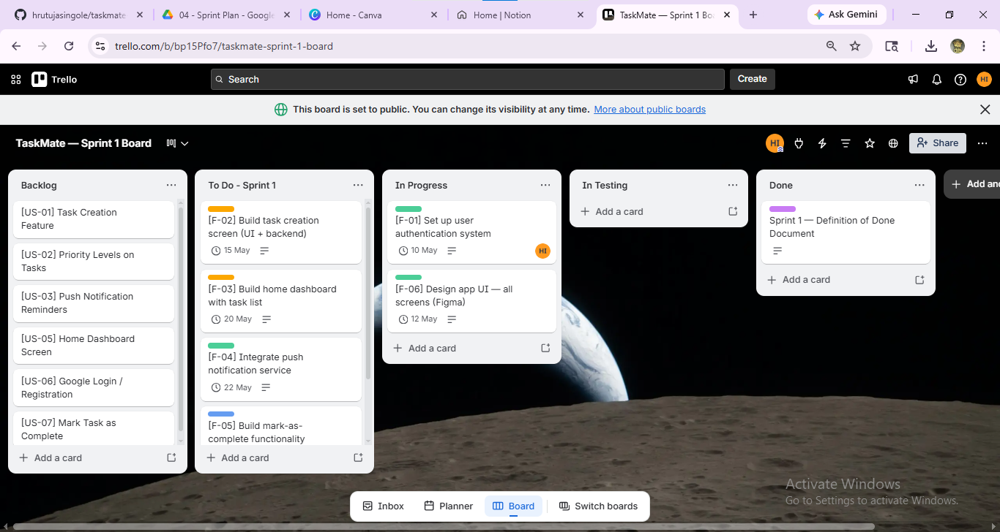
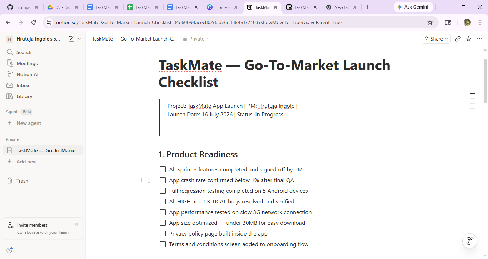
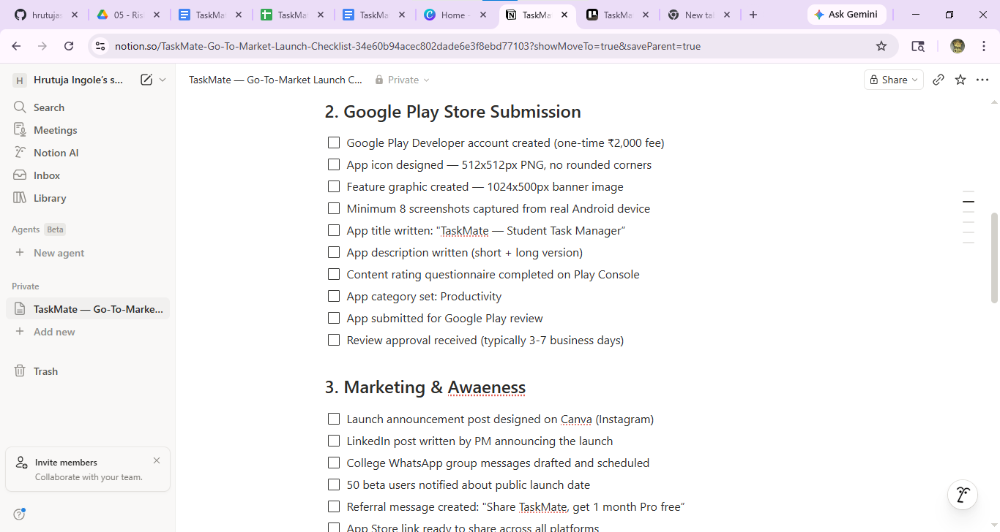
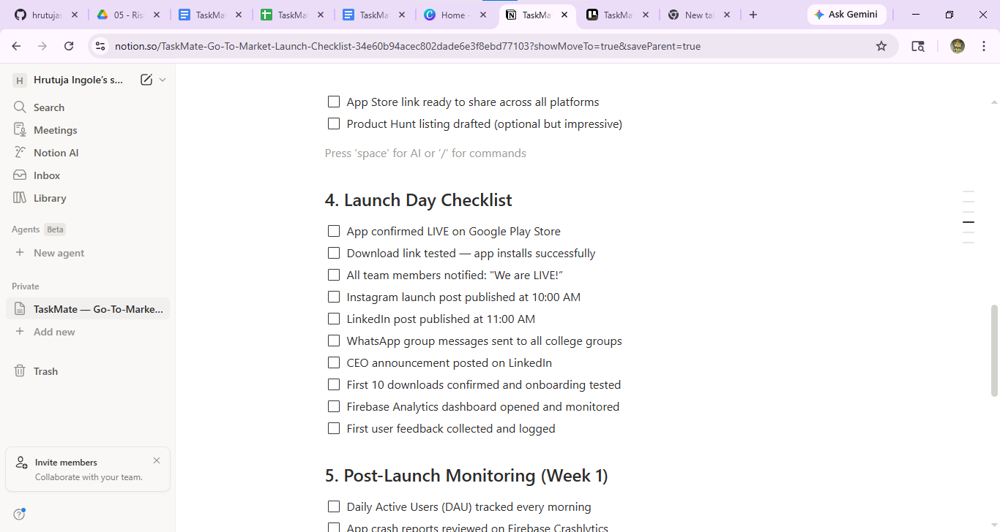
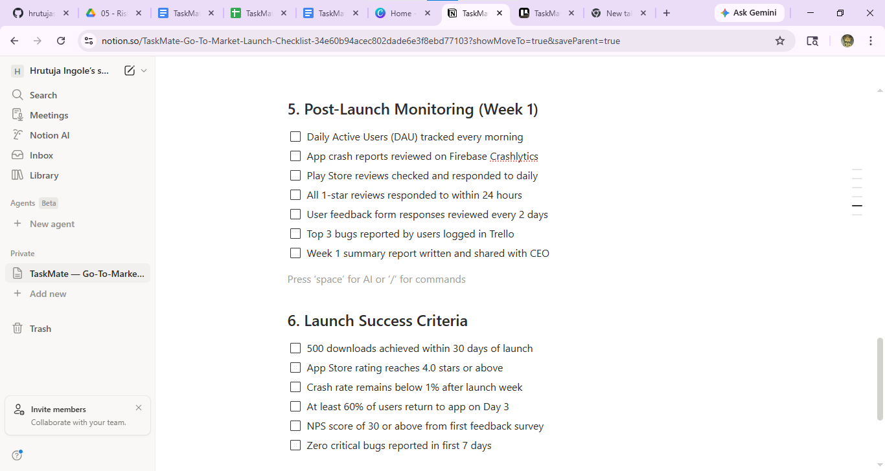

# 📱 TaskMate — Mobile App Launch Plan

> **End-to-end product management case study for a student productivity app — from idea to launch.**

---

## 👤 About This Project

| Field | Details |
|-------|---------|
| Role | Project Manager |
| Organization | TaskMate Inc. (Simulated Startup) |
| Duration | May 2026 – July 2026 (3 Months) |
| Tools Used | Google Docs, Google Sheets, Trello, Notion, Canva |
| Methodology | Agile — Scrum Framework |

This project simulates a complete product launch cycle for **TaskMate** — a mobile productivity app designed for Indian college students who struggle to manage academic deadlines. I managed this project end-to-end as the Project Manager, creating all standard PM artifacts from scratch.

---

## 🎯 Problem Statement

68% of college students miss at least one deadline per semester due to poor personal organization. Existing tools like Google Keep and Apple Reminders are too generic for academic workflows. TaskMate solves this with a purpose-built Android app for students.

---

## 📦 Project Deliverables

### 1. 📄 Project Charter
Defines the project scope, objectives, stakeholders, timeline, budget (₹8,00,000), and sign-off structure.

📁 [View Project Charter](./TaskMate-Project-Charter.pdf)

---

### 2. 👥 User Personas & User Stories
Two detailed user personas and 10 user stories written in standard Agile format with story points and MoSCoW priority.

📁 [View User Personas](./TaskMate-User-Personas.pdf)
📁 [View User Stories](./TaskMate-User-Stories.xlsx)

---

### 3. 🗺️ Product Roadmap
A 3-month feature roadmap across MVP, Beta, and Launch phases. 20 features prioritized using MoSCoW framework.

📁 [View Product Roadmap](./TaskMate-Product-Roadmap.xlsx)

---

### 4. 🏃 Sprint Plan (Agile — Scrum)
Complete sprint simulation on Trello with backlog, story points, acceptance criteria, standup logs and retrospective.

📁 [View Sprint Plan PDF](./TaskMate-Sprint1-Plan.pdf)
🔗 [View Live Trello Board](https://trello.com/b/bp15Pfo7/taskmate-sprint-1-board)

**Sprint 1 Board Preview:**

---

### 5. ⚠️ Risk Register & Stakeholder Map
10 risks with probability-impact scoring and mitigation plans. Stakeholder map with 8 stakeholders using Power vs Interest grid.

📁 [View Risk Register](./TaskMate-Risk-Register.xlsx)
📁 [View Stakeholder Map](./TaskMate-Stakeholder-Map.pdf)

---

### 6. 🚀 Launch Checklist & KPI Dashboard
40+ item go-to-market launch checklist on Notion. KPI dashboard tracking 6 success metrics with weekly trend chart.

🔗 [View Live Notion Checklist](https://www.notion.so/TaskMate-Go-To-Market-Launch-Checklist-34e60b94acec802dade6e3f8ebd77103?source=copy_link
)

**Launch Checklist Preview:**

📁 [View KPI Dashboard](./TaskMate-KPI-Dashboard.xlsx)

---

## 📊 KPI Results — End of Month 1

| KPI | Target | Achieved | Status |
|-----|--------|----------|--------|
| Daily Active Users | 200 DAU | 215 DAU | ✅ Met |
| App Store Rating | 4.0 stars | 4.2 stars | ✅ Met |
| Crash Rate | Below 1% | 0.5% | ✅ Met |
| Day-3 Retention | 60% | 64% | ✅ Met |
| Total Downloads | 500 | 512 | ✅ Met |
| NPS Score | 30 | 34 | ✅ Met |

---

## 🛠️ Tools & Methodologies

| Category | Tool / Method |
|----------|--------------|
| Project Charter | Google Docs |
| User Research | Google Docs + Canva |
| Roadmap | Google Sheets (MoSCoW) |
| Sprint Management | Trello (Scrum / Agile) |
| Risk Management | Google Sheets |
| Launch Planning | Notion |
| KPI Tracking | Google Sheets |
| Methodology | Agile — Scrum Framework |

---

## 📬 Connect With Me

Hrutuja Ingole
Aspiring Project Manager
📧 hrutujasingole@gmail.com
🔗 www.linkedin.com/in/hrutuja-ingole-01325526b
